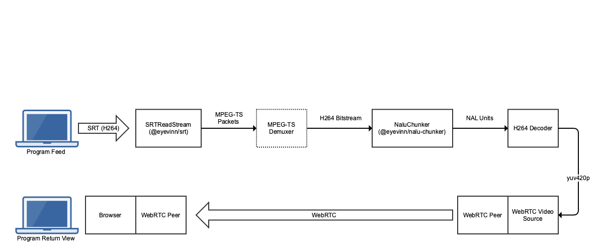

A proof of concept for: Video Source -> SRT -> WebRTC peer (server) -> WebRTC peer (client)


```
npm install
node server.js
```

Accepts SRT connections on port `1234`



## Example

Generate an example stream. Current H264 decoder only handles baseline

```
ffmpeg -re -i F1/F1\ CAN\ APR10.MOV -vf scale=320:180 -c:v libx264 -profile:v baseline -an -f mpegts srt://host.docker.internal:1234
```